# win10 本机跑MapReduce
以《Hadoop权威指南》第二章的天气例子为例  
 
环境： win10, JDK1.8, Intellij idea, hadoop2.7.2  
## 1、idea新建java项目  

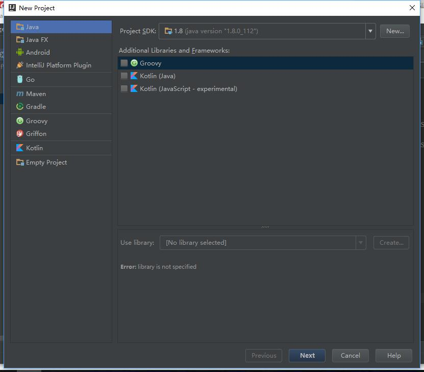  
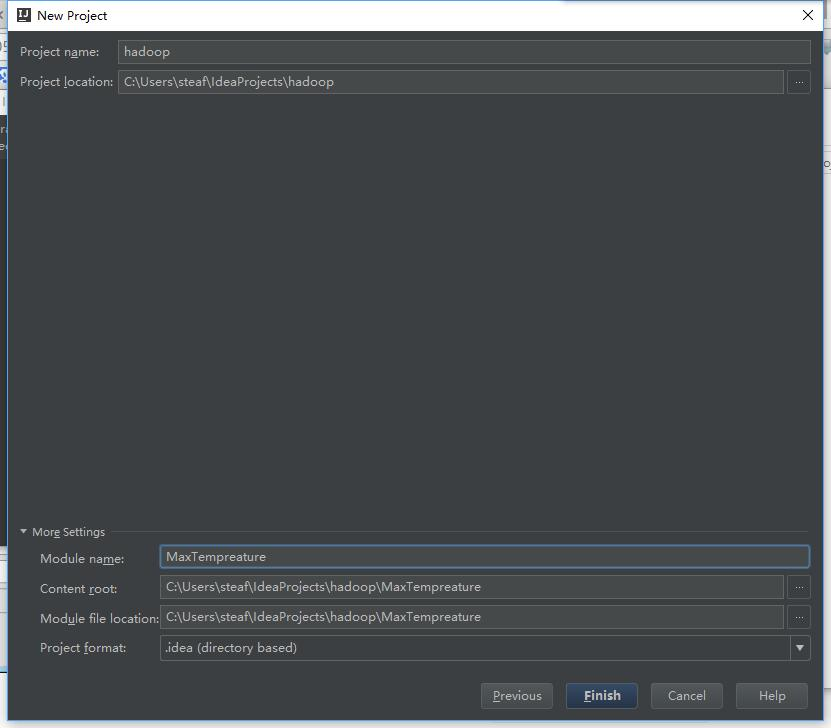  
## 2、项目配置 
 File —- Project Structure 

（1）首先注意SDK的正确配置，使用JDK1.8   
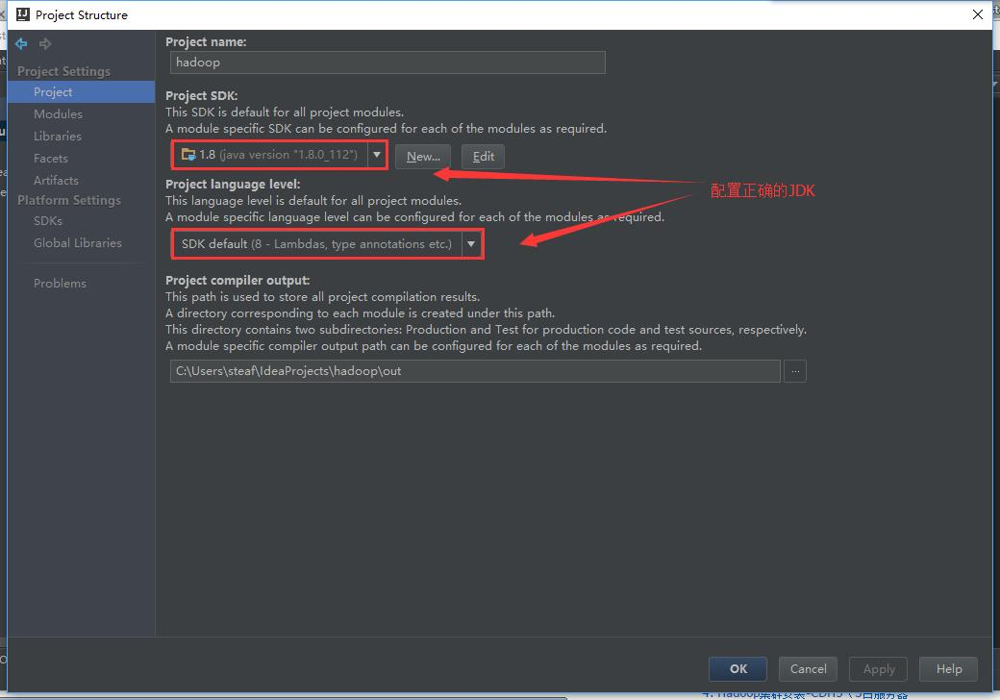  
（2）加入hadoop的jar依赖包   
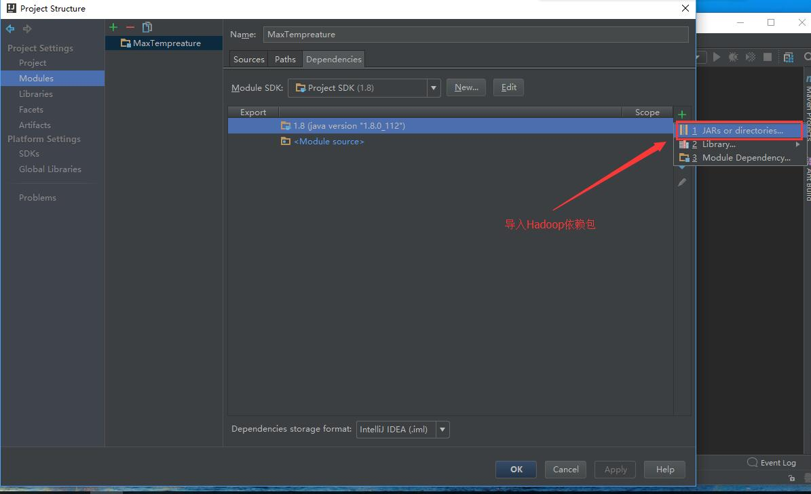   
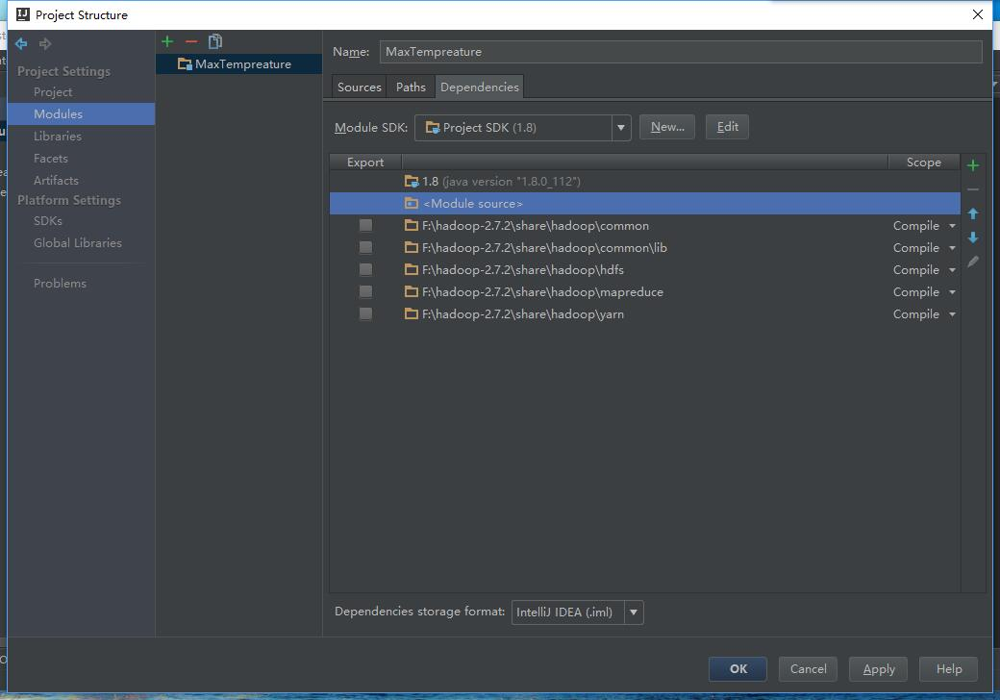   
（3）打包配置   
  
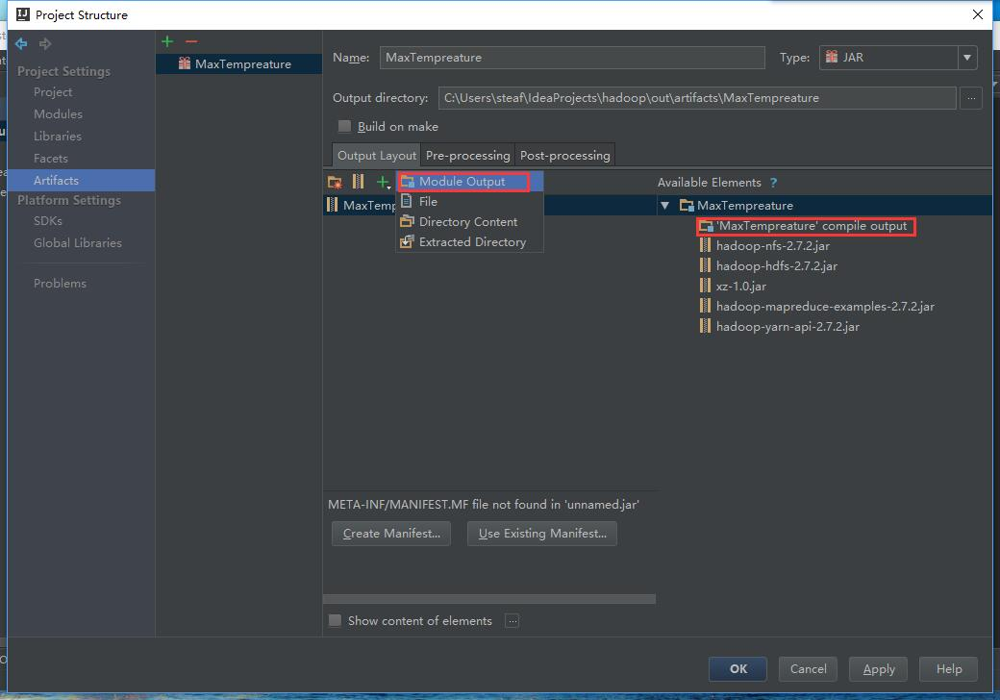  
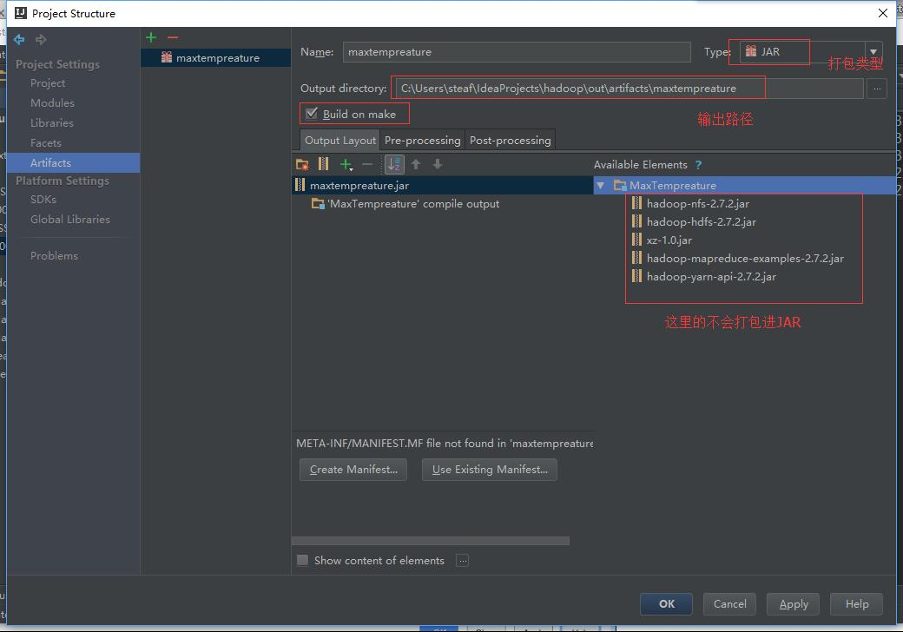  
4.编写map-reduce代码  
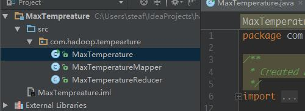  
（1）Mapper 负责预处理文件，准备数据  
    package com.hadoop.tempearture;
    
    import org.apache.hadoop.io.IntWritable;
    import org.apache.hadoop.io.LongWritable;
    import org.apache.hadoop.io.Text;
    import org.apache.hadoop.mapreduce.Mapper;
    
    import java.io.IOException;
    
    public class MaxTemperatureMapper
    	extends Mapper<LongWritable, Text, Text, IntWritable> {  //注1
    	private static final int MISSING = 9999;
    	@Override
    	public void map(LongWritable key, Text value, Context context)
    		throws IOException, InterruptedException {
    		String line = value.toString();
    		String year = line.substring(15, 19);
    		int airTemperature;
    		if (line.charAt(87) == '+') { // parseInt doesn't like leading plus signs
    			airTemperature = Integer.parseInt(line.substring(88, 92));
    		} else {
    			airTemperature = Integer.parseInt(line.substring(87, 92));
    		}
    		String quality = line.substring(92, 93);
    		if (airTemperature != MISSING && quality.matches("[01459]")) {
    			context.write(new Text(year), new IntWritable(airTemperature));
    		}
    	}
    }  
(2)reducer 处理数据  
    package com.hadoop.tempearture;
    
    import org.apache.hadoop.io.IntWritable;
    import org.apache.hadoop.io.Text;
    import org.apache.hadoop.mapreduce.Reducer;
    
    import java.io.IOException;
    
    public class MaxTemperatureReducer
    	extends Reducer<Text, IntWritable, Text, IntWritable> {
    @Override
    public void reduce(Text key, Iterable<IntWritable> values,
       Context context) throws IOException, InterruptedException {
    		int maxValue = Integer.MIN_VALUE;
    		for (IntWritable value : values) {
    			maxValue = Math.max(maxValue, value.get());
    		}
    		context.write(key, new IntWritable(maxValue));
    	}
    }  
(3) main()  
	package com.hadoop.tempearture;
	
	import org.apache.hadoop.fs.Path;
	import org.apache.hadoop.io.IntWritable;
	import org.apache.hadoop.io.Text;
	import org.apache.hadoop.mapreduce.Job;
	import org.apache.hadoop.mapreduce.lib.input.FileInputFormat;
	import org.apache.hadoop.mapreduce.lib.output.FileOutputFormat;
	
	public class MaxTemperature {
	    public static void main(String[] args) throws Exception {
	        if (args.length != 2) {
	            System.err.println("Usage: MaxTemperature <input path> <output path>");
	            System.exit(-1);
	        }
	
	        Job job = new Job();
	        job.setJarByClass(MaxTemperature.class);
	        job.setJobName("Max temperature");
	
	        FileInputFormat.addInputPath(job, new Path(args[0]));
	        FileOutputFormat.setOutputPath(job, new Path(args[1]));
	
	        job.setMapperClass(MaxTemperatureMapper.class);
	        job.setReducerClass(MaxTemperatureReducer.class);
	
	        job.setOutputKeyClass(Text.class);              
	        job.setOutputValueClass(IntWritable.class);
	
	        System.exit(job.waitForCompletion(true) ? 0 : 1);
	    }
	}  
5.配置编译器   
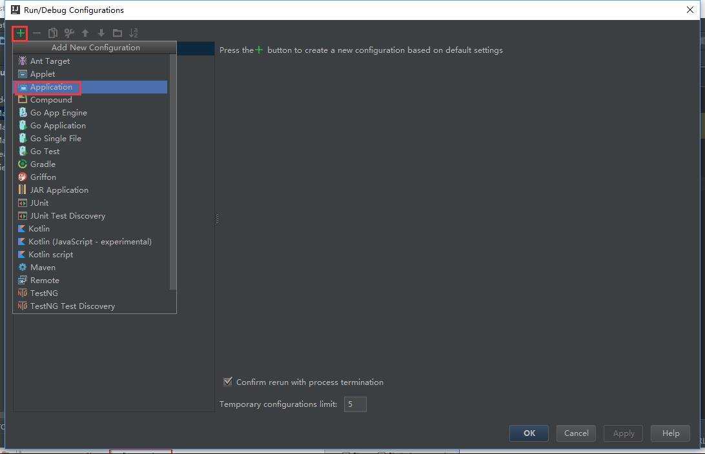   
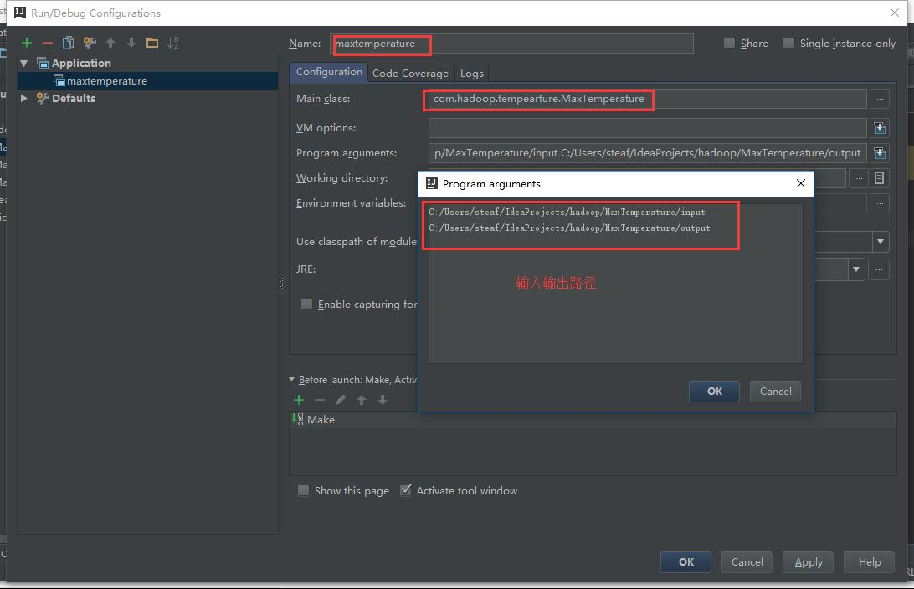   
注意：第三个框里只需添入输入路径和输出路径即可  
6、将数据导入到你的程序中   
  
注意：不要创建output目录，系统会自动创建。否则会报目录已存在的错。  
	simple.txt  
	0067011990999991950051507004+68750+023550FM-12+038299999V0203301N00671220001CN9999999N9+00001+99999999999
	0043011990999991950051512004+68750+023550FM-12+038299999V0203201N00671220001CN9999999N9+00221+99999999999
	0043011990999991950051518004+68750+023550FM-12+038299999V0203201N00261220001CN9999999N9-00111+99999999999
	0043012650999991949032412004+62300+010750FM-12+048599999V0202701N00461220001CN0500001N9+01111+99999999999
	0043012650999991949032418004+62300+010750FM-12+048599999V0202701N00461220001CN0500001N9+00781+99999999999  
7.运行 出错：   
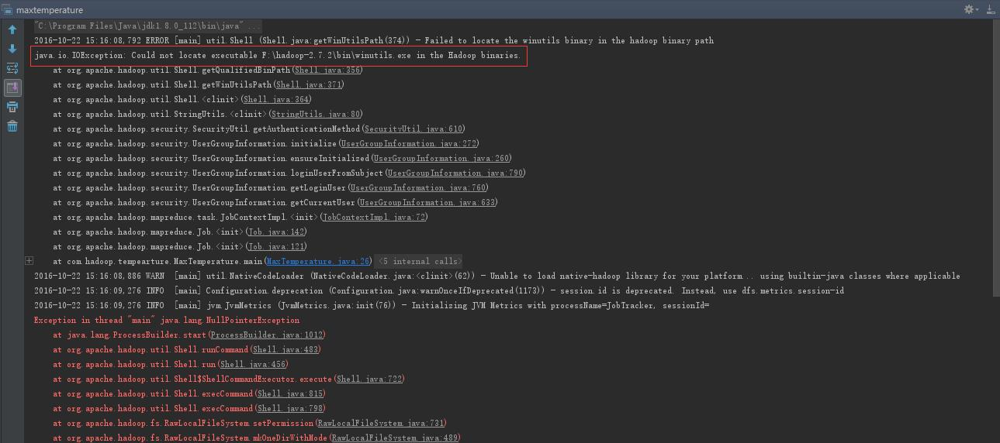  
缺少hadoop.dll和winutils.exe  
hadoop.2.7.2的hadoop.dll和winutils.exe下载后，粘贴在hadoop-2.7.2/bin目录下  
运行成功：   
output目录下有输出的结果文件   
output\part-r-00000.txt  
1949 111   
1950 22
