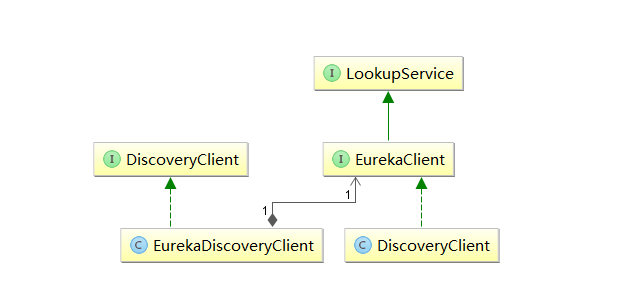
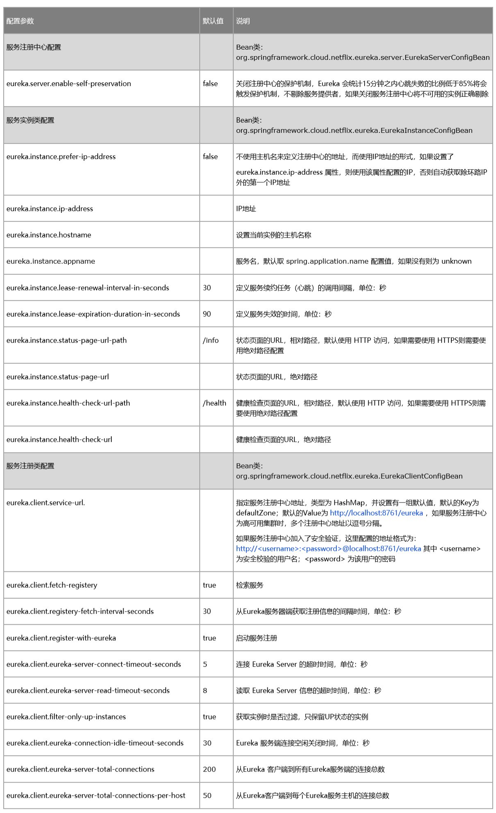

# Eureka 原理以及部分源码（最后提供了 Eureka 的一些常用配置）  
## 1、Eureka 的架构  
以下是 Eureka 的官方架构图  
  
**Application Service** 相当于服务提供者，Application Client相当于服务消费者；  
**Make Remote Call** 可以简单理解为调用RESTful API；  
**us-east-1c、us-east-1d** 等都是zone，它们都属于us-east-1这个region；  
**Eureka Client** 是一个Java客户端，用于简化与Eureka Server的交互；  
**Eureka Server** 提供服务发现的能力，各个微服务启动时，会通过Eureka Client向Eureka Server进行注册自己的信息（例如网络信息），Eureka Server会存储该服务的信息；  
微服务启动后，会周期性地向Eureka Server发送心跳（默认周期为30秒）以续约自己的信息。如果Eureka Server在一定时间内没有接收到某个微服务节点的心跳，Eureka Server将会注销该微服务节点（默认90秒）；  
每个Eureka Server同时也是Eureka Client，多个Eureka Server之间通过复制的方式完成服务注册表的同步；    
**Eureka Client会缓存注册表中的信息** 这种方式有一定的优势
首先,微服务无需每次请求都查询Eureka Server,从而降低了Eureka Server的压力;
其次,即使Eureka Server所有节点都宕掉,服务消费者依然可以使用缓存中的信息找到服务提供者并完成调用.
这样,Eureka通过心跳检测,客户端缓存等机制,提高了系统的灵活性,可伸缩性和可用性  

--  

## 2、部分源码解读  
### 2.1 Register 服务注册  
当Eureka Client启动时，会向Eureka Server发送自己的服务信息（IP地址、端口、ServiceId等信息，如果Eureka Client没有在配置文件中配置ServiceId，则默认为配置文件中配置的服务名，即${spring.application.name}的值）。在eureka-client-1.6.2.jar 中的com.netflix.discovery  包下有一个DiscoveryClient类，该类中包含了服务注册的相关方法。
  
DiscoveryClient类中的register()方法实现注册功能，通过http请求向Eureka Server注册  
    

	 boolean register() throws Throwable {
        logger.info("DiscoveryClient_" + this.appPathIdentifier + ": registering service...");  

        EurekaHttpResponse httpResponse;
        try {
            httpResponse = this.eurekaTransport.registrationClient.register(this.instanceInfo);
        } catch (Exception var3) {
            logger.warn("{} - registration failed {}", new Object[]{"DiscoveryClient_" + this.appPathIdentifier, var3.getMessage(), var3});
            throw var3;
        }

        if (logger.isInfoEnabled()) {
            logger.info("{} - registration status: {}", "DiscoveryClient_" + this.appPathIdentifier, httpResponse.getStatusCode());
        }

        return httpResponse.getStatusCode() == 204;
    }  
register()方法是在InstanceInfoReplicator类中的run()方法调用的，InstanceInfoReplicator类实现了Runnable接口。InstanceInfoReplicator类是在DiscoveryClient类初始化过程中使用的，所以在初始化的时候会向server注册。

以上是EurekaClient中关于注册的方法，接下来看看EurekaServer中关于注册的方法  
在eureka-core下的com.netflix.eureka中有一个BootStrapContext类，BootStraoContext类在程序启动时有最先初始化的权限。该类中使用的PeerAwareInstanceRegistryImpl类中有register方法，该方法提供了服务注册并且将服务注册后的信息同步到其他的EurekaServer中。  
那么又是在什么地方调用该方法呢？前面提到，EurekaClient通过http来向server注册，那么EurekaServer肯定会提供一个接口供client调用。实际上在ApplicationResource类中的addInstance()方法就是服务调用的接口。其代码如下：   
 
		@POST
	    @Consumes({"application/json", "application/xml"})
	    public Response addInstance(InstanceInfo info, @HeaderParam("x-netflix-discovery-replication") String isReplication) {
	        logger.debug("Registering instance {} (replication={})", info.getId(), isReplication);
	        if (this.isBlank(info.getId())) {
	            return Response.status(400).entity("Missing instanceId").build();
	        } else if (this.isBlank(info.getHostName())) {
	            return Response.status(400).entity("Missing hostname").build();
	        } else if (this.isBlank(info.getAppName())) {
	            return Response.status(400).entity("Missing appName").build();
	        } else if (!this.appName.equals(info.getAppName())) {
	            return Response.status(400).entity("Mismatched appName, expecting " + this.appName + " but was " + info.getAppName()).build();
	        } else if (info.getDataCenterInfo() == null) {
	            return Response.status(400).entity("Missing dataCenterInfo").build();
	        } else if (info.getDataCenterInfo().getName() == null) {
	            return Response.status(400).entity("Missing dataCenterInfo Name").build();
	        } else {
	            DataCenterInfo dataCenterInfo = info.getDataCenterInfo();
	            if (dataCenterInfo instanceof UniqueIdentifier) {
	                String dataCenterInfoId = ((UniqueIdentifier)dataCenterInfo).getId();
	                if (this.isBlank(dataCenterInfoId)) {
	                    boolean experimental = "true".equalsIgnoreCase(this.serverConfig.getExperimental("registration.validation.dataCenterInfoId"));
	                    if (experimental) {
	                        String entity = "DataCenterInfo of type " + dataCenterInfo.getClass() + " must contain a valid id";
	                        return Response.status(400).entity(entity).build();
	                    }
	
	                    if (dataCenterInfo instanceof AmazonInfo) {
	                        AmazonInfo amazonInfo = (AmazonInfo)dataCenterInfo;
	                        String effectiveId = amazonInfo.get(MetaDataKey.instanceId);
	                        if (effectiveId == null) {
	                            amazonInfo.getMetadata().put(MetaDataKey.instanceId.getName(), info.getId());
	                        }
	                    } else {
	                        logger.warn("Registering DataCenterInfo of type {} without an appropriate id", dataCenterInfo.getClass());
	                    }
	                }
	            }
	
	            this.registry.register(info, "true".equals(isReplication));
	            return Response.status(204).build();
	        }
	    }
### 2.2 Renew 服务续约  
服务注册在client开启之后开启，同时开启服务续约的定时任务，在DiscoveryClient类下有renew()方法  
  
	boolean renew() {
        try {
            EurekaHttpResponse<InstanceInfo> httpResponse = this.eurekaTransport.registrationClient.sendHeartBeat(this.instanceInfo.getAppName(), this.instanceInfo.getId(), this.instanceInfo, (InstanceStatus)null);
            logger.debug("{} - Heartbeat status: {}", "DiscoveryClient_" + this.appPathIdentifier, httpResponse.getStatusCode());
            if (httpResponse.getStatusCode() == 404) {
                this.REREGISTER_COUNTER.increment();
                logger.info("{} - Re-registering apps/{}", "DiscoveryClient_" + this.appPathIdentifier, this.instanceInfo.getAppName());
                return this.register();
            } else {
                return httpResponse.getStatusCode() == 200;
            }
        } catch (Throwable var3) {
            logger.error("{} - was unable to send heartbeat!", "DiscoveryClient_" + this.appPathIdentifier, var3);
            return false;
        }
    }  
服务续约时间相关控制参数在spring-configration-metadata.json中有定义：  
  
		{
	      "sourceType": "org.springframework.cloud.netflix.eureka.EurekaInstanceConfigBean",
	      "defaultValue": 90,
	      "name": "eureka.instance.lease-expiration-duration-in-seconds",
	      "description": "Indicates the time in seconds that the eureka server waits since it received the\n last heartbeat before it can remove this instance from its view and there by\n disallowing traffic to this instance.\n\n Setting this value too long could mean that the traffic could be routed to the\n instance even though the instance is not alive. Setting this value too small could\n mean, the instance may be taken out of traffic because of temporary network\n glitches.This value to be set to atleast higher than the value specified in\n leaseRenewalIntervalInSeconds.",
	      "type": "java.lang.Integer"
	    },
	    {
	      "sourceType": "org.springframework.cloud.netflix.eureka.EurekaInstanceConfigBean",
	      "defaultValue": 30,
	      "name": "eureka.instance.lease-renewal-interval-in-seconds",
	      "description": "Indicates how often (in seconds) the eureka client needs to send heartbeats to\n eureka server to indicate that it is still alive. If the heartbeats are not\n received for the period specified in leaseExpirationDurationInSeconds, eureka\n server will remove the instance from its view, there by disallowing traffic to this\n instance.\n\n Note that the instance could still not take traffic if it implements\n HealthCheckCallback and then decides to make itself unavailable.",
	      "type": "java.lang.Integer"
	    },  
### 2.3 为什么官方不建议修改服务续约时间----Eureka的自我保护机制  
当每分钟心跳次数( renewsLastMin ) 小于 numberOfRenewsPerMinThreshold 时，并且开启自动保护模式开关( eureka.enableSelfPreservation = true ) 时，触发自动保护机制，不再自动过期租约，实现代码如下：  

计算公式如下：

expectedNumberOfRenewsPerMin = 当前注册的应用实例数 x 2
numberOfRenewsPerMinThreshold = expectedNumberOfRenewsPerMin * 续租百分比( eureka.renewalPercentThreshold )    

	// AbstractInstanceRegistry.java
	public void evict(long additionalLeaseMs) {
	
	   if (!isLeaseExpirationEnabled()) {
	       logger.debug("DS: lease expiration is currently disabled.");
	       return;
	   }
	
	   // ... 省略过期租约逻辑
	}
	
	// PeerAwareInstanceRegistryImpl.java
	@Override
	public boolean isLeaseExpirationEnabled() {
	   if (!isSelfPreservationModeEnabled()) {
	       // The self preservation mode is disabled, hence allowing the instances to expire.
	       return true;
	   }
	   return numberOfRenewsPerMinThreshold > 0 && getNumOfRenewsInLastMin() > numberOfRenewsPerMinThreshold;
	}
  

为什么乘以 2

默认情况下，注册的应用实例每半分钟续租一次，那么一分钟心跳两次，因此 x 2 。（就是在程序中已经写死了乘以2）  

这块会有一些硬编码的情况，**因此不太建议修改应用实例的续租频率**。

为什么乘以续租百分比

低于这个百分比，意味着开启自我保护机制。

默认情况下，eureka.renewalPercentThreshold = 0.85 。

**如果你真的调整了续租频率，可以等比去续租百分比**，以保证合适的触发自我保护机制的阀值。另外，你需要注意，续租频率是 Client 级别，续租百分比是 Server 级别。
   
   
	// 在eureka-core下PeerAwareInstanceRegistryImpl.java
	private void updateRenewalThreshold() {
        try {
            Applications apps = this.eurekaClient.getApplications();
            int count = 0;
            Iterator var3 = apps.getRegisteredApplications().iterator();

            while(var3.hasNext()) {
                Application app = (Application)var3.next();
                Iterator var5 = app.getInstances().iterator();

                while(var5.hasNext()) {
                    InstanceInfo instance = (InstanceInfo)var5.next();
                    if (this.isRegisterable(instance)) {
                        ++count;
                    }
                }
            }

            Object var10 = this.lock;
            synchronized(this.lock) {
                if ((double)(count * 2) > this.serverConfig.getRenewalPercentThreshold() * (double)this.numberOfRenewsPerMinThreshold || !this.isSelfPreservationModeEnabled()) {
                    this.expectedNumberOfRenewsPerMin = count * 2;
                    this.numberOfRenewsPerMinThreshold = (int)((double)(count * 2) * this.serverConfig.getRenewalPercentThreshold());
                }
            }

            logger.info("Current renewal threshold is : {}", this.numberOfRenewsPerMinThreshold);
        } catch (Throwable var9) {
            logger.error("Cannot update renewal threshold", var9);
        }

    }  

--  

## Eureka 的常用配置说明

